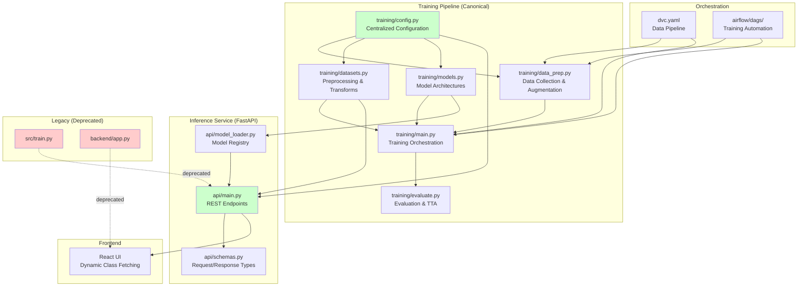

# Design Document: ML Codebase Consolidation

## Overview

This design document specifies the technical architecture for consolidating the Pakistani Politician Face Recognition ML codebase. The system currently suffers from significant technical debt: duplicate training pipelines (`training/` vs `src/`), duplicate inference services (FastAPI vs Flask), inconsistent preprocessing across training/evaluation/inference, hardcoded class labels, and fragmented configuration. The consolidation must preserve all trained model checkpoints while eliminating redundancy and ensuring consistency.

### Current State

The codebase has evolved organically, resulting in:

- **Duplicate Training Pipelines**: `training/` (canonical, ArcFace-based) and `src/` (legacy, MLflow-based)
- **Duplicate Inference Services**: `api/` (FastAPI) and `backend/` (Flask)
- **Inconsistent Preprocessing**: Different transforms in training, evaluation, and inference
- **Hardcoded Class Labels**: Frontend has hardcoded `CLASS_MAPPINGS`, API imports from `src/train.py`
- **Fragmented Dependencies**: DVC and Airflow reference both `src/` and `training/` modules
- **Model Loading Complexity**: Multiple checkpoint formats, inconsistent ArcFace logit reconstruction

### Target State

After consolidation:

- **Single Training Pipeline**: `training/` as the canonical source, `src/` deprecated
- **Single Inference Service**: FastAPI as primary, Flask deprecated
- **Consistent Preprocessing**: Identical transforms across training/eval/inference
- **Dynamic Class Labels**: API exposes `/classes` endpoint, frontend fetches dynamically
- **Centralized Configuration**: All settings in `training/config.py`
- **Unified Model Loading**: Consistent checkpoint format and loading logic
- **Preserved Checkpoints**: All existing `.pth` files remain loadable

### Design Principles

1. **Preservation First**: Never modify or delete model checkpoints
2. **Incremental Migration**: Verify each change before proceeding
3. **Backward Compatibility**: Support existing checkpoint formats
4. **Single Source of Truth**: One canonical implementation per component
5. **Fail-Safe Defaults**: Graceful degradation when components are unavailable

## Architecture

### System Components



### Component Responsibilities

#### 1. Configuration Layer (`training/config.py`)

**Purpose**: Single source of truth for all hyperparameters, paths, and feature flags.

**Responsibilities**:
- Define canonical class list (`CLASS_NAMES`) in sorted order
- Specify model architectures to train (`MODELS_TO_TRAIN`)
- Configure preprocessing parameters (image size, normalization)
- Set training hyperparameters (epochs, batch size, learning rate)
- Define ArcFace parameters (margin, scale)
- Configure TTA settings (5-crop + flip)
- Support environment variable overrides (`MODEL_DIR`, `MODEL_PATH`, `OUTPUT_DIR`)

**Key Design Decisions**:
- Class names sorted alphabetically to ensure index stability
- Environment detection for Kaggle/Colab/local execution
- Backward compatibility aliases (`IMG_SIZE` = `IMAGE_SIZE`)

#### 2. Data Preparation Layer (`training/data_prep.py`)

**Purpose**: Data collection, face alignment, deduplication, splitting, and augmentation.

**Responsibilities**:
- Load Kaggle datasets
- Merge `data/raw` and `data/raw2` into `data/raw_merged`
- MTCNN face alignment with configurable margin
- pHash-based deduplication
- Stratified train/val/test split
- Offline augmentation for under-represented classes

**Key Design Decisions**:
- MTCNN alignment with `margin_ratio=0.2` for consistent face crops
- pHash distance threshold of 5 for near-duplicate detection
- Minimum 5 images per class for splitting
- Augmentation only for classes with < 120 images

#### 3. Dataset Layer (`training/datasets.py`)

**Purpose**: PyTorch Dataset and DataLoader creation with model-specific preprocessing.

**Responsibilities**:
- `PoliticianDataset`: Custom dataset wrapping train/val/test folders
- `get_transforms()`: Model-specific normalization (ArcFace vs ImageNet)
- `create_dataloaders()`: Factory for train/val/test loaders with class weights
- TTA transforms: 5-crop + flip for evaluation

**Key Design Decisions**:
- **ArcFace models** (`inception_resnet_v1*`): Normalize to `[-1, 1]` with `mean=[0.5, 0.5, 0.5]`, `std=[0.5, 0.5, 0.5]`
- **Classifier models** (`resnet50`): ImageNet normalization `mean=[0.485, 0.456, 0.406]`, `std=[0.229, 0.224, 0.225]`
- **TTA**: 5-crop (4 corners + center) + horizontal flip = 10 views
- Image size: 336×336 for ArcFace, 224×224 for classifiers

#### 4. Model Layer (`training/models.py`)

**Purpose**: Model architecture definitions and checkpoint management.

**Responsibilities**:
- `FaceEmbeddingModel`: InceptionResnetV1 with optional ArcFace head
- `EfficientNetEmbeddingModel`: EfficientNet-B3 with embedding layer
- `get_model()`: Factory function for model instantiation
- Checkpoint saving with `arcface_eval` dictionary for logit reconstruction

**Key Design Decisions**:
- **ArcFace models**: Return embeddings only during training, use `arcface_eval` for inference
- **Checkpoint format**: `{model_state_dict, arcface_eval: {weight, scale}, class_names, epoch, ...}`
- **Logit reconstruction**: `logits = scale * (normalize(embeddings) @ normalize(weight).T)`

#### 5. Training Layer (`training/main.py`, `training/training.py`)

**Purpose**: End-to-end training orchestration.

**Responsibilities**:
- Install dependencies (Kaggle-friendly)
- Execute data preparation pipeline
- Train all models in `config.MODELS_TO_TRAIN`
- Save checkpoints with `arcface_eval` dictionary
- Generate training curves and metrics

**Key Design Decisions**:
- MixUp augmentation with `alpha=0.2`, `prob=0.5`
- Early stopping with patience=10
- Gradient clipping with `max_norm=1.0`
- Class-weighted loss for imbalanced data

#### 6. Evaluation Layer (`training/evaluate.py`)

**Purpose**: Model evaluation with TTA and mislabeled sample detection.

**Responsibilities**:
- Load checkpoints and reconstruct logits from embeddings
- Apply TTA (5-crop + flip) when enabled
- Generate confusion matrices and classification reports
- Optional mislabeled sample audit

**Key Design Decisions**:
- **TTA handling**: Average softmax probabilities across 10 views
- **ArcFace logit reconstruction**: Use stored `arcface_eval['weight']` and `arcface_eval['scale']`
- **Fallback logic**: Try `arcface_eval` first, then `model.head`, then raise error

#### 7. Inference Service Layer (`api/main.py`, `api/model_loader.py`)

**Purpose**: REST API for real-time predictions.

**Responsibilities**:
- `/classes`: Return canonical class list from `training.config`
- `/predict`: Single image prediction with optional TTA
- `/predict/batch`: Batch prediction
- `/health`: Service health check
- Model registry and lazy loading

**Key Design Decisions**:
- **Import migration**: Import from `training.config` and `training.datasets` instead of `src.train`
- **Model loading**: Lazy instantiation via `backend.model_loader.get_predictor()`
- **MTCNN robustness**: Retry detection on 2× upscaled image if initial detection fails
- **EXIF handling**: Apply `ImageOps.exif_transpose()` before face detection
- **Multi-face handling**: Select largest face by bounding box area
- **Backward compatibility**: Accept both `image` and `file` form fields

#### 8. Model Loader Layer (`backend/model_loader.py`)

**Purpose**: Unified model loading and prediction logic.

**Responsibilities**:
- Discover checkpoints in multiple directories (`project_outputs/models/`, `models/saved/`, `models/`)
- Load ArcFace and classifier models
- MTCNN face alignment with landmark-based rotation correction
- Embedding-to-logit conversion using `arcface_eval`
- Prediction with top-k results

**Key Design Decisions**:
- **Checkpoint discovery**: Search `MODEL_DIR` env var, then fallback directories
- **Model type inference**: Check for `arcface_eval` dict to determine ArcFace vs classifier
- **MTCNN parameters**: `min_face_size=20`, `thresholds=[0.5, 0.6, 0.7]` for improved small face detection
- **Upscale fallback**: If no face detected, upscale image 2× (capped at 2000px) and retry
- **Landmark alignment**: Rotate image to align eyes horizontally, then crop with margin

#### 9. Orchestration Layer (DVC, Airflow)

**Purpose**: Automate data pipelines and training workflows.

**Responsibilities**:
- **DVC**: Version datasets, track pipeline stages
- **Airflow**: Schedule training runs, manage dependencies

**Key Design Decisions**:
- **Import migration**: All stages import from `training.*` instead of `src.*`
- **Stage definitions**: `collect_data`, `split_data`, `augment`, `train`, `evaluate`
- **Dependency tracking**: DVC tracks data files, Airflow tracks task dependencies

### Data Flow

#### Training Flow

```
Raw Images (data/raw, data/raw2)
  ↓ merge_raw_folders()
data/raw_merged/
  ↓ align_faces_mtcnn() [if USE_FACE_ALIGNMENT=True]
data/aligned/
  ↓ deduplicate_phash() [if REMOVE_DUPLICATES=True]
data/aligned/ (deduplicated)
  ↓ split_dataset()
dataset/train/, dataset/val/, dataset/test/
  ↓ run_offline_augmentation() [if USE_OFFLINE_AUGMENTATION=True]
dataset/train/ (augmented)
  ↓ create_dataloaders()
DataLoader (with transforms)
  ↓ train_model()
Checkpoint (.pth with arcface_eval)
  ↓ evaluate_model()
Metrics, Confusion Matrix, Classification Report
```

#### Inference Flow

```
User uploads image
  ↓ ImageOps.exif_transpose()
Oriented image
  ↓ MTCNN.detect() [for ArcFace models]
Face bounding box + landmarks
  ↓ align_face_with_landmarks()
Aligned face (336×336)
  ↓ transforms (normalize)
Tensor
  ↓ model(tensor)
Embeddings (512-dim)
  ↓ embeddings_to_logits() [using arcface_eval]
Logits (16-dim)
  ↓ softmax()
Probabilities
  ↓ top-k selection
Prediction response
```

## Components and Interfaces

### 1. Configuration Interface

**Module**: `training/config.py`

**Exports**:
```python
class Config:
    # Paths
    RAW_DIR: str = "data/raw_merged"
    ALIGNED_DIR: str = "data/aligned"
    DATA_DIR: str = "dataset"
    OUTPUT_DIR: str  # Environment-dependent
    
    # Dataset
    NUM_CLASSES: int = 16
    CLASS_NAMES: List[str]  # Sorted alphabetically
    
    # Training
    EPOCHS: int = 30
    BATCH_SIZE: int = 32
    LEARNING_RATE: float = 0.001
    WEIGHT_DECAY: float = 0.0001
    EARLY_STOPPING_PATIENCE: int = 10
    
    # Models
    MODELS_TO_TRAIN: List[str] = ["inception_resnet_v1", "inception_resnet_v1_casia", "resnet50"]
    MODEL_BACKBONE: str = "inception_resnet_v1"
    
    # Image settings
    IMAGE_SIZE: int = 336
    
    # Augmentation
    USE_OFFLINE_AUGMENTATION: bool = True
    NUM_AUGMENTATIONS: int = 3
    MIN_IMAGES_FOR_OFFLINE_AUG: int = 120
    
    # Face alignment
    USE_FACE_ALIGNMENT: bool = True
    ALIGN_MARGIN: float = 0.2
    REMOVE_DUPLICATES: bool = True
    DEDUP_PHASH_DISTANCE: int = 5
    
    # Loss and class balancing
    USE_FOCAL_LOSS: bool = False
    USE_CLASS_WEIGHTS: bool = True
    
    # MixUp
    USE_MIXUP: bool = True
    MIXUP_ALPHA: float = 0.2
    MIXUP_PROB: float = 0.5
    
    # Evaluation
    USE_TTA: bool = True
    TTA_NUM_AUGMENTATIONS: int = 5  # 5 crops + flips = 10 views
    SHOW_MISCLASSIFIED: bool = True
    USE_ENSEMBLE: bool = True
    
    # ArcFace
    USE_ARCFACE: bool = True
    ARCFACE_MARGIN: float = 0.3
    ARCFACE_SCALE: float = 64.0
    HEAD_LR: float = 1e-4
    BACKBONE_UNFREEZE_LR: float = 3e-6
    GRADIENT_CLIP_MAX_NORM: float = 1.0

config = Config()
```

**Environment Variables**:
- `OUTPUT_DIR`: Override output directory (default: `project_outputs`)
- `MODEL_DIR`: Model checkpoint directory for inference
- `MODEL_PATH`: Specific model checkpoint path

### 2. Dataset Interface

**Module**: `training/datasets.py`

**Exports**:
```python
class PoliticianDataset(Dataset):
    def __init__(self, root_dir: str, transform: Optional[Callable] = None, return_path: bool = False)
    def __len__(self) -> int
    def __getitem__(self, idx: int) -> Tuple[Tensor, int] | Tuple[Tensor, int, str]

def get_transforms(split: str = 'train', model_name: Optional[str] = None) -> transforms.Compose
    """
    Args:
        split: 'train', 'val', or 'test'
        model_name: Model architecture name for normalization selection
    Returns:
        Composed transforms with model-specific normalization
    """

def create_dataloaders(model_name: Optional[str] = None) -> Tuple[DataLoader, DataLoader, DataLoader, Optional[Tensor]]
    """
    Returns:
        train_loader, val_loader, test_loader, class_weights
    """
```

**Transform Specifications**:

| Split | Model Type | Transforms |
|-------|-----------|------------|
| train | All | RandomResizedCrop(336, scale=(0.7, 1.0)), RandomHorizontalFlip(), ColorJitter(0.3, 0.3, 0.2), ToTensor(), Normalize(), RandomErasing(p=0.25) |
| val | All | Resize(336), CenterCrop(336), ToTensor(), Normalize() |
| test (no TTA) | All | Resize(336), CenterCrop(336), ToTensor(), Normalize() |
| test (TTA) | All | Resize(336), FiveCrop(336), Lambda(tta_stack) → 10 views |

**Normalization**:
- **ArcFace** (`inception_resnet_v1*`): `mean=[0.5, 0.5, 0.5]`, `std=[0.5, 0.5, 0.5]`
- **Classifier** (`resnet50`): `mean=[0.485, 0.456, 0.406]`, `std=[0.229, 0.224, 0.225]`

### 3. Model Interface

**Module**: `training/models.py`

**Exports**:
```python
class FaceEmbeddingModel(nn.Module):
    def __init__(self, num_classes: int, pretrained: str = 'vggface2', dropout: float = 0.5, use_arcface: bool = True)
    def forward(self, x: Tensor, return_embeddings: bool = False) -> Tensor | Tuple[Tensor, Tensor]

class EfficientNetEmbeddingModel(nn.Module):
    def __init__(self, num_classes: int, dropout: float = 0.5)
    def forward(self, x: Tensor, return_embeddings: bool = False) -> Tuple[Tensor, Tensor]

def get_model(model_name: str, num_classes: int, pretrained: bool = True) -> nn.Module
```

**Checkpoint Format**:
```python
{
    'model_state_dict': OrderedDict,  # Model weights
    'arcface_eval': {  # For ArcFace models only
        'weight': Tensor,  # Shape: (num_classes, embedding_dim)
        'scale': float     # Default: 64.0
    },
    'class_names': List[str],  # Canonical class list
    'epoch': int,
    'best_val_acc': float,
    'optimizer_state_dict': OrderedDict,
    'scheduler_state_dict': OrderedDict
}
```

### 4. API Interface

**Module**: `api/main.py`

**Endpoints**:

#### GET `/`
**Response**:
```json
{
  "message": "Pakistani Politician Image Classifier API",
  "version": "1.0.0",
  "endpoints": {
    "health": "/health",
    "classes": "/classes",
    "predict": "/predict",
    "batch_predict": "/predict/batch"
  }
}
```

#### GET `/health`
**Response**:
```json
{
  "status": "ok",
  "models_loaded": ["inception_resnet_v1", "inception_resnet_v1_casia", "resnet50"],
  "device": "cuda"
}
```

#### GET `/classes`
**Response**:
```json
{
  "classes": [
    "ahmed_sharif_chaudhry",
    "ahsan_iqbal",
    ...
  ],
  "count": 16
}
```

#### POST `/predict`
**Request**:
- Form data: `file` or `image` (image file)
- Form data: `model_name` (optional, defaults to best model)
- Form data: `tta` (optional, boolean, defaults to false)

**Response** (success):
```json
{
  "predicted_class": "imran_khan",
  "confidence": 0.9234,
  "top3": [
    {"class_name": "imran_khan", "confidence": 0.9234},
    {"class_name": "shahbaz_sharif", "confidence": 0.0456},
    {"class_name": "nawaz_sharif", "confidence": 0.0123}
  ],
  "model_used": "inception_resnet_v1",
  "inference_time_ms": 145.23
}
```

**Response** (error):
```json
{
  "error": "No face detected"
}
```

#### POST `/predict/batch`
**Request**:
- Form data: `files` (list of image files)
- Form data: `model_name` (optional)

**Response**:
```json
{
  "predictions": [
    {
      "predicted_class": "imran_khan",
      "confidence": 0.9234,
      "top3": [...],
      "model_used": "inception_resnet_v1",
      "inference_time_ms": 145.23
    },
    ...
  ],
  "total_images": 10,
  "total_time_ms": 1523.45
}
```

### 5. Model Loader Interface

**Module**: `backend/model_loader.py`

**Exports**:
```python
class ModelPredictor:
    def __init__(self, model_path: Optional[str] = None, device: Optional[str] = None, model_key: Optional[str] = None)
    def align_face(self, image: Image.Image) -> Optional[Image.Image]
    def embeddings_to_logits(self, embeddings: Tensor) -> Tensor
    def predict_pil(self, image: Image.Image, top_k: int = 3) -> Dict

def get_predictor(model_key: Optional[str] = None) -> ModelPredictor
def predict(image_path: str, model_key: Optional[str] = None) -> Dict
```

**Model Choices**:
```python
MODEL_CHOICES = {
    "inception_resnet_v1": {
        "filename": "inception_resnet_v1_best.pth",
        "pretrained": "vggface2",
        "type": "arcface"
    },
    "inception_resnet_v1_casia": {
        "filename": "inception_resnet_v1_casia_best.pth",
        "pretrained": "casia-webface",
        "type": "arcface"
    },
    "resnet50": {
        "filename": "resnet50_best.pth",
        "type": "classifier",
        "arch": "resnet50"
    }
}
```

## Data Models

### Class Label Model

**Purpose**: Canonical ordered list of politician names.

**Schema**:
```python
CLASS_NAMES: List[str] = [
    "ahmed_sharif_chaudhry",
    "ahsan_iqbal",
    "altaf_hussain",
    "asfandyar_wali",
    "asif_ali_zardari",
    "barrister_gohar",
    "bilawal_bhutto",
    "chaudhry_shujaat",
    "fazlur_rehman",
    "imran_khan",
    "khawaja_asif",
    "maryam_nawaz",
    "nawaz_sharif",
    "pervez_musharraf",
    "shahbaz_sharif",
    "shehryar_afridi"
]
```

**Invariants**:
- Length = 16
- Sorted alphabetically
- Matches folder names in `data/raw_merged/`
- Index-to-name mapping must remain stable across training/eval/inference

### Checkpoint Model

**Purpose**: Serialized model weights and metadata.

**Schema**:
```python
{
    'model_state_dict': OrderedDict[str, Tensor],
    'arcface_eval': Optional[Dict[str, Any]] = {
        'weight': Tensor,  # Shape: (num_classes, embedding_dim)
        'scale': float
    },
    'class_names': List[str],
    'epoch': int,
    'best_val_acc': float,
    'optimizer_state_dict': OrderedDict[str, Tensor],
    'scheduler_state_dict': Dict[str, Any]
}
```

**Invariants**:
- `model_state_dict` must be loadable into model architecture
- `arcface_eval` required for ArcFace models, absent for classifiers
- `class_names` length must match `model_state_dict` output dimension
- `arcface_eval['weight']` shape must be `(num_classes, embedding_dim)`

### Prediction Model

**Purpose**: API response for single prediction.

**Schema**:
```python
{
    'predicted_class': str,
    'confidence': float,  # Range: [0, 1]
    'top3': List[Dict[str, Any]] = [
        {'class_name': str, 'confidence': float},
        ...
    ],
    'model_used': str,
    'inference_time_ms': float
}
```

**Invariants**:
- `predicted_class` must be in `CLASS_NAMES`
- `confidence` must be in [0, 1]
- `top3` must have length ≤ 3
- `top3[0]` must match `predicted_class` and `confidence`
- `top3` must be sorted by confidence descending

## Error Handling

### Error Categories

#### 1. Face Detection Errors

**Scenario**: No face detected in uploaded image

**Handling**:
- MTCNN returns `None` for boxes/landmarks
- Retry detection on 2× upscaled image (capped at 2000px)
- If still no detection, return HTTP 200 with `{"error": "No face detected"}`
- Log warning with image metadata (size, format)

**User Experience**: Clear error message explaining no face was found

#### 2. Model Loading Errors

**Scenario**: Requested model not found

**Handling**:
- Check `MODEL_CHOICES` for valid model keys
- Search checkpoint directories in order: `MODEL_DIR` env var, `project_outputs/models/`, `models/saved/`, `models/`
- If not found, return HTTP 400 with `{"error": "Model 'X' not found. Available: [...]"}`
- Log error with searched paths

**User Experience**: List of available models to choose from

#### 3. Checkpoint Loading Errors

**Scenario**: Checkpoint file corrupted or incompatible

**Handling**:
- Attempt to load checkpoint with `torch.load()`
- Validate required keys: `model_state_dict`, `class_names`
- For ArcFace models, validate `arcface_eval` dict with `weight` and `scale`
- If validation fails, return HTTP 500 with `{"error": "Model checkpoint not found: <path>"}`
- Log full stack trace for debugging

**User Experience**: Generic error message (internal error details in logs)

#### 4. Invalid Image Errors

**Scenario**: Uploaded file is not a valid image

**Handling**:
- Check `content_type` starts with `image/`
- Attempt to open with `PIL.Image.open()`
- If fails, return HTTP 400 with `{"error": "File must be an image"}`
- Log error with file metadata

**User Experience**: Clear message that file must be an image

#### 5. EXIF Orientation Errors

**Scenario**: Image has EXIF orientation metadata

**Handling**:
- Apply `ImageOps.exif_transpose()` before face detection
- If EXIF parsing fails, continue with original image
- Log warning if EXIF handling fails

**User Experience**: Transparent handling (no user-visible error)

#### 6. Preprocessing Errors

**Scenario**: Image too small or corrupted

**Handling**:
- Validate `min(image.size) >= config.MIN_IMAGE_SIZE` (default: 60px)
- If too small, return HTTP 400 with `{"error": "Image too small (minimum 60px)"}`
- If preprocessing fails, log error and return HTTP 500

**User Experience**: Clear size requirement message

#### 7. Inference Errors

**Scenario**: Model inference fails (OOM, device error)

**Handling**:
- Wrap inference in try-except
- Catch CUDA OOM errors specifically
- Return HTTP 500 with `{"error": "<descriptive message>"}`
- Log full stack trace with device info

**User Experience**: Generic error message (details in logs)

#### 8. Configuration Errors

**Scenario**: Missing or invalid configuration

**Handling**:
- Validate `config.CLASS_NAMES` length matches `config.NUM_CLASSES`
- Validate `config.CLASS_NAMES` is sorted
- Validate all required paths exist
- Raise `ValueError` with descriptive message during initialization
- Log configuration state

**User Experience**: Service fails to start (deployment issue)

### Error Response Format

All API errors follow consistent JSON format:

```json
{
  "error": "<descriptive message>"
}
```

**HTTP Status Codes**:
- `200`: Success (even if no face detected, to maintain backward compatibility)
- `400`: Client error (invalid input, model not found)
- `500`: Server error (internal failure, checkpoint loading error)

### Logging Strategy

**Log Levels**:
- `DEBUG`: Detailed execution flow (transform parameters, tensor shapes)
- `INFO`: Normal operations (model loaded, prediction completed)
- `WARNING`: Recoverable errors (no face detected, EXIF handling failed)
- `ERROR`: Unrecoverable errors (checkpoint loading failed, inference failed)

**Log Format**:
```
[TIMESTAMP] [LEVEL] [MODULE] [FUNCTION] - MESSAGE
```

**Logged Information**:
- Request metadata (model name, image size, content type)
- Execution timing (inference time, face detection time)
- Error details (stack trace, checkpoint path, device info)
- Model metadata (architecture, checkpoint path, device)

<function_calls>
<invoke name="prework">
<parameter name="featureName">ml-codebase-consolidation


## Testing Strategy

### Overview

This ML codebase consolidation is **not suitable for property-based testing** because:

1. **Infrastructure Focus**: Requirements are about code organization, import migration, and configuration
2. **One-Time Operations**: Audit, deprecation, and migration are not repeatable with varying inputs
3. **Integration Dependencies**: Most testable requirements depend on external systems (DVC, Airflow, file system)
4. **Specific Validations**: Requirements test specific files and configurations rather than universal properties

Instead, the testing strategy focuses on:
- **Integration tests**: Verify API endpoints, model loading, and pipeline execution
- **Example-based unit tests**: Test specific scenarios (no face detected, invalid checkpoint)
- **Smoke tests**: Verify configuration, documentation, and deprecation markers
- **Regression tests**: Ensure consolidation doesn't break existing functionality

### Test Categories

#### 1. Configuration Tests

**Purpose**: Verify centralized configuration is correct and consistent.

**Tests**:
- `test_class_names_sorted()`: Verify `config.CLASS_NAMES` is sorted alphabetically
- `test_class_names_count()`: Verify `len(config.CLASS_NAMES) == 16`
- `test_class_names_match_folders()`: Verify `config.CLASS_NAMES` matches `data/raw_merged/` folder names
- `test_environment_variable_overrides()`: Verify `OUTPUT_DIR`, `MODEL_DIR`, `MODEL_PATH` env vars work
- `test_model_specific_normalization()`: Verify ArcFace uses `[-1, 1]`, ResNet uses ImageNet normalization

**Framework**: pytest

**Example**:
```python
def test_class_names_sorted():
    from training.config import config
    assert config.CLASS_NAMES == sorted(config.CLASS_NAMES), "CLASS_NAMES must be sorted"
    assert len(config.CLASS_NAMES) == 16, "Must have exactly 16 classes"
```

#### 2. Import Migration Tests

**Purpose**: Verify all imports use `training.*` instead of `src.*`.

**Tests**:
- `test_api_imports_from_training()`: Verify `api/main.py` imports from `training.config` and `training.datasets`
- `test_no_src_imports_in_api()`: Verify no `from src` or `import src` in `api/main.py`
- `test_dvc_references_training()`: Verify `dvc.yaml` references `training/` modules
- `test_airflow_references_training()`: Verify `airflow/dags/` imports from `training.*`
- `test_no_src_references_in_docker()`: Verify Docker files don't reference `src/`

**Framework**: pytest with file parsing

**Example**:
```python
def test_api_imports_from_training():
    with open('api/main.py') as f:
        content = f.read()
    assert 'from training.config import' in content or 'from training import config' in content
    assert 'from training.datasets import' in content
    assert 'from src' not in content
```

#### 3. API Endpoint Tests

**Purpose**: Verify FastAPI service endpoints work correctly.

**Tests**:
- `test_classes_endpoint()`: Verify `/classes` returns 16 class names in correct order
- `test_classes_endpoint_schema()`: Verify response has `{"classes": [...], "count": 16}` structure
- `test_predict_endpoint()`: Verify `/predict` returns valid prediction
- `test_predict_no_face()`: Verify `/predict` returns `{"error": "No face detected"}` for no-face image
- `test_predict_invalid_model()`: Verify `/predict` returns 400 for invalid model name
- `test_predict_invalid_image()`: Verify `/predict` returns 400 for non-image file
- `test_predict_with_tta()`: Verify `/predict` with `tta=true` produces different results
- `test_predict_backward_compatibility()`: Verify both `image` and `file` form fields work
- `test_health_endpoint()`: Verify `/health` returns status and loaded models

**Framework**: pytest with FastAPI TestClient

**Example**:
```python
from fastapi.testclient import TestClient
from api.main import app

client = TestClient(app)

def test_classes_endpoint():
    response = client.get("/classes")
    assert response.status_code == 200
    data = response.json()
    assert "classes" in data
    assert "count" in data
    assert data["count"] == 16
    assert len(data["classes"]) == 16
    assert data["classes"] == sorted(data["classes"])
```

#### 4. Model Loading Tests

**Purpose**: Verify all existing checkpoints can be loaded.

**Tests**:
- `test_load_all_checkpoints()`: Discover all `.pth` files and verify they load
- `test_checkpoint_has_required_keys()`: Verify checkpoints have `model_state_dict`, `class_names`
- `test_arcface_checkpoint_has_eval_dict()`: Verify ArcFace checkpoints have `arcface_eval`
- `test_arcface_eval_weight_shape()`: Verify `arcface_eval['weight']` shape is `(num_classes, embedding_dim)`
- `test_class_names_match_output_dim()`: Verify `len(class_names)` matches model output dimension
- `test_model_loader_discovers_checkpoints()`: Verify `ModelLoader` finds checkpoints in all directories
- `test_model_loader_handles_tensor_and_ndarray()`: Verify `arcface_eval['weight']` works as Tensor or ndarray

**Framework**: pytest

**Example**:
```python
import torch
from pathlib import Path

def test_load_all_checkpoints():
    checkpoint_dirs = [
        Path('project_outputs/models'),
        Path('models/saved'),
        Path('models')
    ]
    
    checkpoints = []
    for d in checkpoint_dirs:
        if d.exists():
            checkpoints.extend(d.glob('*.pth'))
    
    assert len(checkpoints) > 0, "No checkpoints found"
    
    for ckpt_path in checkpoints:
        checkpoint = torch.load(ckpt_path, map_location='cpu')
        assert 'model_state_dict' in checkpoint, f"{ckpt_path} missing model_state_dict"
        assert 'class_names' in checkpoint, f"{ckpt_path} missing class_names"
        assert len(checkpoint['class_names']) == 16, f"{ckpt_path} has wrong class count"
```

#### 5. Preprocessing Consistency Tests

**Purpose**: Verify preprocessing is identical across training/eval/inference.

**Tests**:
- `test_arcface_normalization()`: Verify ArcFace models use `mean=[0.5, 0.5, 0.5]`, `std=[0.5, 0.5, 0.5]`
- `test_resnet_normalization()`: Verify ResNet models use ImageNet normalization
- `test_arcface_image_size()`: Verify ArcFace preprocessing outputs `(3, 336, 336)` tensors
- `test_resnet_image_size()`: Verify ResNet preprocessing outputs `(3, 224, 224)` tensors
- `test_val_test_transforms_identical()`: Verify `get_transforms('val')` == `get_transforms('test')` (without TTA)
- `test_tta_produces_10_views()`: Verify TTA creates exactly 10 views (5 crops × 2 flips)
- `test_mtcnn_parameters()`: Verify MTCNN uses `margin_ratio=0.2`, `min_face_size=20`, `thresholds=[0.5, 0.6, 0.7]`

**Framework**: pytest

**Example**:
```python
from training.datasets import get_transforms
from training.config import config

def test_arcface_normalization():
    transform = get_transforms('val', model_name='inception_resnet_v1')
    # Extract Normalize transform
    normalize = None
    for t in transform.transforms:
        if isinstance(t, transforms.Normalize):
            normalize = t
            break
    
    assert normalize is not None, "No Normalize transform found"
    assert normalize.mean == [0.5, 0.5, 0.5], "Wrong mean for ArcFace"
    assert normalize.std == [0.5, 0.5, 0.5], "Wrong std for ArcFace"
```

#### 6. ArcFace Logit Reconstruction Tests

**Purpose**: Verify logit reconstruction is consistent.

**Tests**:
- `test_embeddings_normalized()`: Verify embeddings are normalized to unit length
- `test_weight_matrix_normalized()`: Verify weight matrix is normalized to unit length
- `test_scale_applied()`: Verify cosine similarities are multiplied by scale
- `test_logit_reconstruction_deterministic()`: Verify same embeddings produce same logits
- `test_evaluation_inference_logits_match()`: Verify evaluation and inference produce identical logits for same input

**Framework**: pytest

**Example**:
```python
import torch
import torch.nn.functional as F
from training.config import config

def test_embeddings_normalized():
    # Simulate embedding-to-logit conversion
    embeddings = torch.randn(1, 512)
    weight = torch.randn(16, 512)
    scale = 64.0
    
    embeddings_norm = F.normalize(embeddings, dim=1)
    weight_norm = F.normalize(weight, dim=1)
    logits = scale * (embeddings_norm @ weight_norm.t())
    
    # Verify embeddings are unit length
    assert torch.allclose(torch.norm(embeddings_norm, dim=1), torch.ones(1)), "Embeddings not normalized"
```

#### 7. MTCNN Robustness Tests

**Purpose**: Verify face detection handles edge cases.

**Tests**:
- `test_no_face_detected()`: Verify returns `{"error": "No face detected"}` for no-face image
- `test_multiple_faces_selects_largest()`: Verify largest face is selected when multiple detected
- `test_upscale_fallback()`: Verify detection retries on 2× upscaled image if initial detection fails
- `test_upscale_coordinate_scaling()`: Verify bounding boxes scale correctly after upscale
- `test_exif_orientation_handling()`: Verify EXIF orientation is applied before detection
- `test_small_face_detection()`: Verify `min_face_size=20` allows small face detection

**Framework**: pytest with test images

**Example**:
```python
from PIL import Image
from backend.model_loader import ModelPredictor

def test_no_face_detected():
    predictor = ModelPredictor(model_key='inception_resnet_v1')
    # Create blank image
    blank_image = Image.new('RGB', (224, 224), color='white')
    result = predictor.predict_pil(blank_image)
    assert 'error' in result
    assert result['error'] == 'No face detected.'
```

#### 8. TTA Parity Tests

**Purpose**: Verify TTA works identically in evaluation and inference.

**Tests**:
- `test_tta_produces_10_views()`: Verify TTA creates 10 views (5 crops + 5 flipped crops)
- `test_tta_averages_probabilities()`: Verify softmax probabilities are averaged across views
- `test_tta_vs_no_tta()`: Verify TTA produces different results than single-view inference
- `test_evaluation_inference_tta_match()`: Verify evaluation and inference TTA produce same results

**Framework**: pytest

**Example**:
```python
from training.datasets import get_transforms
import torch

def test_tta_produces_10_views():
    transform = get_transforms('test', model_name='inception_resnet_v1')
    image = Image.new('RGB', (336, 336), color='blue')
    
    # Apply TTA transform
    views = transform(image)
    
    assert views.shape[0] == 10, f"Expected 10 views, got {views.shape[0]}"
    assert views.shape[1:] == (3, 336, 336), f"Wrong view shape: {views.shape[1:]}"
```

#### 9. Inference Accuracy Verification Tests

**Purpose**: Verify inference matches evaluation predictions.

**Tests**:
- `test_inference_matches_evaluation()`: For 10 random test images, verify `/predict` matches `evaluate.py` predictions
- `test_confidence_tolerance()`: Verify confidence differences are within 0.01 tolerance
- `test_top3_consistency()`: Verify top-3 predictions match between evaluation and inference

**Framework**: pytest with integration test

**Example**:
```python
import random
from pathlib import Path
from fastapi.testclient import TestClient
from api.main import app
from training.evaluate import evaluate_model

client = TestClient(app)

def test_inference_matches_evaluation():
    test_dir = Path('dataset/test')
    test_images = []
    for class_dir in test_dir.iterdir():
        if class_dir.is_dir():
            test_images.extend(list(class_dir.glob('*.jpg'))[:2])
    
    selected = random.sample(test_images, min(10, len(test_images)))
    
    for img_path in selected:
        # Get evaluation prediction
        # (This requires loading model and running evaluation)
        
        # Get inference prediction
        with open(img_path, 'rb') as f:
            response = client.post('/predict', files={'file': f})
        
        assert response.status_code == 200
        inference_result = response.json()
        
        # Compare predictions
        # assert evaluation_result['predicted_class'] == inference_result['predicted_class']
        # assert abs(evaluation_result['confidence'] - inference_result['confidence']) < 0.01
```

#### 10. Deprecation Tests

**Purpose**: Verify legacy code is properly deprecated.

**Tests**:
- `test_src_directory_has_deprecation_notice()`: Verify `src/README.md` exists with deprecation warning
- `test_flask_service_has_deprecation_notice()`: Verify `backend/README.md` exists with deprecation warning
- `test_no_active_src_references()`: Verify no active code references `src/` modules

**Framework**: pytest

**Example**:
```python
from pathlib import Path

def test_src_directory_has_deprecation_notice():
    readme_path = Path('src/README.md')
    assert readme_path.exists(), "src/README.md not found"
    
    content = readme_path.read_text()
    assert 'DEPRECATED' in content.upper(), "Deprecation notice not found"
    assert 'training/' in content, "Migration path not documented"
```

#### 11. Regression Tests

**Purpose**: Ensure consolidation doesn't break existing functionality.

**Tests**:
- `test_all_models_load()`: Verify all three model architectures load successfully
- `test_predict_endpoint_works()`: Verify `/predict` returns valid predictions
- `test_classes_endpoint_works()`: Verify `/classes` returns correct class list
- `test_tta_works()`: Verify TTA produces valid predictions
- `test_batch_predict_works()`: Verify `/predict/batch` handles multiple images

**Framework**: pytest

**Example**:
```python
def test_all_models_load():
    from api.model_loader import model_loader
    
    available_models = model_loader.get_available_models()
    assert len(available_models) >= 3, f"Expected at least 3 models, found {len(available_models)}"
    
    for model_name in available_models:
        model = model_loader.get_model(model_name)
        assert model is not None, f"Failed to load {model_name}"
```

### Test Execution

**Local Development**:
```bash
# Run all tests
pytest tests/ -v

# Run specific test category
pytest tests/test_config.py -v
pytest tests/test_api.py -v
pytest tests/test_model_loading.py -v

# Run with coverage
pytest tests/ --cov=training --cov=api --cov=backend --cov-report=html
```

**CI/CD Pipeline**:
```yaml
# .github/workflows/test.yml
name: Test Suite
on: [push, pull_request]
jobs:
  test:
    runs-on: ubuntu-latest
    steps:
      - uses: actions/checkout@v2
      - name: Set up Python
        uses: actions/setup-python@v2
        with:
          python-version: 3.8
      - name: Install dependencies
        run: |
          pip install -r requirements.txt
          pip install pytest pytest-cov
      - name: Run tests
        run: pytest tests/ -v --cov=training --cov=api --cov=backend
```

### Test Coverage Goals

- **Configuration**: 100% (all config values tested)
- **API Endpoints**: 100% (all endpoints and error cases)
- **Model Loading**: 90% (all checkpoint formats, error handling)
- **Preprocessing**: 90% (all transforms, TTA, normalization)
- **Error Handling**: 80% (all error paths, edge cases)

### Manual Testing Checklist

After automated tests pass, perform manual verification:

1. **Model Loading**: Verify all checkpoints in `project_outputs/models/` load successfully
2. **API Testing**: Upload test images via Postman/curl, verify predictions
3. **Frontend Integration**: Test frontend with FastAPI backend, verify class names display
4. **DVC Pipeline**: Run `dvc repro`, verify all stages execute
5. **Airflow DAG**: Trigger DAG, verify all tasks complete
6. **Docker Deployment**: Build Docker image, verify service starts and responds
7. **End-to-End**: Upload image via frontend, verify prediction displays correctly

### Test Data

**Test Images**:
- `tests/fixtures/images/valid_face.jpg`: Image with single clear face
- `tests/fixtures/images/no_face.jpg`: Image with no face
- `tests/fixtures/images/multiple_faces.jpg`: Image with multiple faces
- `tests/fixtures/images/small_face.jpg`: Image with small face (< 60px)
- `tests/fixtures/images/rotated.jpg`: Image with EXIF orientation metadata
- `tests/fixtures/images/invalid.txt`: Non-image file

**Test Checkpoints**:
- `tests/fixtures/checkpoints/arcface_valid.pth`: Valid ArcFace checkpoint
- `tests/fixtures/checkpoints/arcface_missing_eval.pth`: ArcFace checkpoint without `arcface_eval`
- `tests/fixtures/checkpoints/classifier_valid.pth`: Valid classifier checkpoint
- `tests/fixtures/checkpoints/invalid.pth`: Corrupted checkpoint


## Migration Plan

### Phase 1: Audit and Documentation (No Code Changes)

**Objective**: Understand current state before making changes.

**Tasks**:
1. Document all class label definitions and locations
2. Identify class name mismatches between `training/config.py` and `frontend/src/App.tsx`
3. Document preprocessing differences between training/eval/inference
4. Document model loading logic and checkpoint formats
5. Trace DVC and Airflow dependencies
6. Identify all `src/` imports in `api/main.py`, `dvc.yaml`, `airflow/dags/`
7. Identify redundant code across training pipelines and inference services
8. Produce audit report

**Deliverable**: `AUDIT_REPORT.md` with all findings

**Verification**: Review audit report for completeness

**Risk**: None (read-only operations)

### Phase 2: Configuration Centralization

**Objective**: Ensure all configuration is in `training/config.py`.

**Tasks**:
1. Verify `CLASS_NAMES` is sorted alphabetically
2. Verify `CLASS_NAMES` matches `data/raw_merged/` folder names
3. Add environment variable support for `MODEL_DIR`, `MODEL_PATH`, `OUTPUT_DIR`
4. Document all configuration parameters
5. Add validation for `CLASS_NAMES` length and sorting

**Deliverable**: Updated `training/config.py` with validation

**Verification**:
- Run `pytest tests/test_config.py`
- Verify `config.CLASS_NAMES` is sorted
- Verify `len(config.CLASS_NAMES) == 16`

**Risk**: Low (configuration changes only)

### Phase 3: API Import Migration

**Objective**: Migrate FastAPI service to import from `training.*`.

**Tasks**:
1. Update `api/main.py`:
   - Change `from src.train import get_transforms, CLASS_NAMES` to `from training.datasets import get_transforms` and `from training.config import config`
   - Update `CLASS_NAMES` references to `config.CLASS_NAMES`
2. Update `api/model_loader.py`:
   - Ensure it uses `backend.model_loader.get_predictor()` for model loading
3. Test `/predict` endpoint with sample images
4. Test `/classes` endpoint

**Deliverable**: Updated `api/main.py` with `training.*` imports

**Verification**:
- Run `pytest tests/test_api.py`
- Test `/predict` endpoint manually
- Test `/classes` endpoint manually
- Verify no `from src` imports in `api/main.py`

**Risk**: Medium (could break API if imports fail)

**Rollback**: Revert `api/main.py` to previous version

### Phase 4: Add `/classes` Endpoint

**Objective**: Enable dynamic class label fetching.

**Tasks**:
1. Implement `/classes` endpoint in `api/main.py`:
   ```python
   @app.get("/classes", response_model=ClassesResponse)
   async def get_classes():
       return ClassesResponse(
           classes=config.CLASS_NAMES,
           count=len(config.CLASS_NAMES)
       )
   ```
2. Add `ClassesResponse` schema to `api/schemas.py`
3. Test endpoint

**Deliverable**: Working `/classes` endpoint

**Verification**:
- Run `pytest tests/test_api.py::test_classes_endpoint`
- Test endpoint manually: `curl http://localhost:8000/classes`
- Verify response has correct structure and data

**Risk**: Low (new endpoint, doesn't affect existing functionality)

### Phase 5: Frontend Migration

**Objective**: Remove hardcoded class mappings from frontend.

**Tasks**:
1. Update `frontend/src/App.tsx`:
   - Remove `CLASS_MAPPINGS` dictionary
   - Add API call to `/classes` on component mount
   - Store class names in state
   - Use API-provided names for display
2. Add fallback for when `/classes` is unavailable
3. Test frontend with FastAPI backend

**Deliverable**: Updated frontend with dynamic class fetching

**Verification**:
- Test frontend loads and displays predictions
- Verify no hardcoded class names in `App.tsx`
- Test with API unavailable (verify fallback)

**Risk**: Medium (could break frontend display)

**Rollback**: Revert `App.tsx` to previous version

### Phase 6: Model Loading Consistency

**Objective**: Ensure consistent model loading across evaluation and inference.

**Tasks**:
1. Verify `backend/model_loader.py` handles all checkpoint formats:
   - `model_state_dict` key
   - `arcface_eval` dict with `weight` and `scale`
   - `class_names` list
2. Add support for both `torch.Tensor` and `numpy.ndarray` for `arcface_eval['weight']`
3. Add device placement for `arcface_eval['weight']`
4. Test loading all existing checkpoints

**Deliverable**: Updated `backend/model_loader.py` with robust loading

**Verification**:
- Run `pytest tests/test_model_loading.py`
- Test loading all checkpoints in `project_outputs/models/`
- Verify no checkpoint loading errors

**Risk**: High (could break model loading)

**Rollback**: Revert `backend/model_loader.py` to previous version

### Phase 7: MTCNN Robustness

**Objective**: Improve face detection reliability.

**Tasks**:
1. Update `backend/model_loader.py`:
   - Add EXIF orientation handling with `ImageOps.exif_transpose()`
   - Add upscale fallback (2× upscale, capped at 2000px)
   - Add coordinate scaling for upscaled detections
   - Update MTCNN parameters: `min_face_size=20`, `thresholds=[0.5, 0.6, 0.7]`
2. Test with challenging images (small faces, rotated, multiple faces)

**Deliverable**: Updated `backend/model_loader.py` with robust face detection

**Verification**:
- Run `pytest tests/test_mtcnn.py`
- Test with small face images
- Test with rotated images (EXIF orientation)
- Test with multiple face images

**Risk**: Medium (could affect face detection accuracy)

**Rollback**: Revert MTCNN parameters to previous values

### Phase 8: TTA Implementation

**Objective**: Ensure TTA works identically in evaluation and inference.

**Tasks**:
1. Verify `training/datasets.py` TTA implementation:
   - 5-crop (4 corners + center)
   - Horizontal flip for each crop
   - Total 10 views
2. Add TTA support to `/predict` endpoint:
   - Add optional `tta` parameter
   - Apply TTA transforms if enabled
   - Average softmax probabilities across views
3. Test TTA vs non-TTA predictions

**Deliverable**: Working TTA in inference

**Verification**:
- Run `pytest tests/test_tta.py`
- Test `/predict` with `tta=true`
- Verify TTA produces different results than non-TTA
- Compare evaluation and inference TTA results

**Risk**: Low (optional feature)

### Phase 9: DVC Pipeline Migration

**Objective**: Update DVC stages to use `training.*` modules.

**Tasks**:
1. Update `dvc.yaml`:
   - Change `collect_data` stage to call `training.data_prep`
   - Change `split_data` stage to call `training.data_prep.split_dataset`
   - Change `augment` stage to call `training.data_prep.run_offline_augmentation`
   - Change `train` stage to call `training.main`
   - Change `evaluate` stage to call `training.evaluate`
2. Test `dvc repro`

**Deliverable**: Updated `dvc.yaml` with `training.*` references

**Verification**:
- Run `dvc repro` (dry run first)
- Verify all stages execute without errors
- Verify outputs are generated

**Risk**: High (could break data pipeline)

**Rollback**: Revert `dvc.yaml` to previous version

### Phase 10: Airflow DAG Migration

**Objective**: Update Airflow tasks to use `training.*` modules.

**Tasks**:
1. Update `airflow/dags/training_pipeline.py`:
   - Change imports from `src.*` to `training.*`
   - Update task function calls
2. Test DAG parsing
3. Test DAG execution (dry run)

**Deliverable**: Updated Airflow DAG with `training.*` imports

**Verification**:
- Run `airflow dags list` to verify DAG parses
- Run `airflow tasks test` for each task
- Verify no import errors

**Risk**: High (could break training automation)

**Rollback**: Revert `airflow/dags/training_pipeline.py` to previous version

### Phase 11: Inference Accuracy Verification

**Objective**: Verify inference matches evaluation predictions.

**Tasks**:
1. Create verification script:
   - Select 10 random test images
   - Run evaluation using `training/evaluate.py`
   - Run inference using `/predict` endpoint
   - Compare predicted class and confidence
   - Report differences > 0.01 confidence tolerance
2. Run verification script
3. Investigate and fix any discrepancies

**Deliverable**: Verification report showing inference accuracy

**Verification**:
- Run verification script
- Verify all predictions match within tolerance
- Document any discrepancies

**Risk**: Low (verification only, no code changes)

### Phase 12: Deprecation and Documentation

**Objective**: Mark legacy code as deprecated and document migration.

**Tasks**:
1. Create `src/README.md` with deprecation notice:
   ```markdown
   # DEPRECATED
   
   This directory contains legacy training code that has been superseded by the `training/` directory.
   
   **Do not use this code for new development.**
   
   ## Migration Path
   
   - `src/train.py` → `training/main.py`
   - `src/collect_data.py` → `training/data_prep.py`
   - `src/split_dataset.py` → `training/data_prep.py::split_dataset`
   - `src/augment.py` → `training/data_prep.py::run_offline_augmentation`
   - `src/evaluate.py` → `training/evaluate.py`
   
   ## Safe Deletion Checklist
   
   Before deleting this directory, verify:
   - [ ] No imports from `src.*` in `api/`, `dvc.yaml`, `airflow/dags/`
   - [ ] No references in Docker files
   - [ ] No references in deployment scripts
   - [ ] No references in CI/CD pipelines
   ```
2. Create `backend/README.md` with Flask deprecation notice
3. Update main `README.md` with consolidation summary

**Deliverable**: Deprecation notices and updated documentation

**Verification**:
- Verify `src/README.md` exists
- Verify `backend/README.md` exists
- Verify main `README.md` updated

**Risk**: None (documentation only)

### Phase 13: Regression Testing

**Objective**: Ensure all functionality still works after consolidation.

**Tasks**:
1. Run full test suite: `pytest tests/ -v`
2. Test all API endpoints manually
3. Test frontend with API
4. Test model loading for all checkpoints
5. Test DVC pipeline (dry run)
6. Test Airflow DAG (dry run)
7. Document any failures

**Deliverable**: Test report showing all tests pass

**Verification**:
- All pytest tests pass
- All manual tests pass
- No regressions identified

**Risk**: Low (testing only)

### Phase 14: Deployment Verification

**Objective**: Verify consolidated system works in production.

**Tasks**:
1. Build Docker image
2. Start Docker container
3. Test health endpoint
4. Test prediction endpoint
5. Test frontend connection
6. Test end-to-end prediction flow
7. Monitor logs for errors

**Deliverable**: Deployed system with verified functionality

**Verification**:
- Docker container starts successfully
- All endpoints respond
- Frontend displays predictions
- No errors in logs

**Risk**: High (production deployment)

**Rollback**: Revert to previous Docker image

## Verification Procedures

### Pre-Migration Verification

**Checklist**:
- [ ] All existing checkpoints documented
- [ ] Checkpoint checksums recorded
- [ ] Current API responses captured for comparison
- [ ] Current test accuracy recorded
- [ ] Audit report completed and reviewed

### Post-Migration Verification

**Checklist**:
- [ ] All checkpoint checksums unchanged
- [ ] All checkpoints load successfully
- [ ] API responses match pre-migration format
- [ ] Test accuracy unchanged (within 0.01 tolerance)
- [ ] No `src.*` imports in active code
- [ ] All tests pass
- [ ] DVC pipeline executes successfully
- [ ] Airflow DAG parses and executes successfully
- [ ] Frontend displays predictions correctly
- [ ] Docker deployment works

### Checkpoint Verification Script

```python
import hashlib
from pathlib import Path
import torch

def compute_checkpoint_hash(path):
    """Compute SHA256 hash of checkpoint file."""
    sha256 = hashlib.sha256()
    with open(path, 'rb') as f:
        for chunk in iter(lambda: f.read(4096), b''):
            sha256.update(chunk)
    return sha256.hexdigest()

def verify_checkpoints():
    """Verify all checkpoints are unchanged and loadable."""
    checkpoint_dirs = [
        Path('project_outputs/models'),
        Path('models/saved'),
        Path('models')
    ]
    
    results = []
    for d in checkpoint_dirs:
        if not d.exists():
            continue
        for ckpt_path in d.glob('*.pth'):
            # Compute hash
            hash_val = compute_checkpoint_hash(ckpt_path)
            
            # Try loading
            try:
                checkpoint = torch.load(ckpt_path, map_location='cpu')
                loadable = True
                error = None
            except Exception as e:
                loadable = False
                error = str(e)
            
            results.append({
                'path': str(ckpt_path),
                'hash': hash_val,
                'loadable': loadable,
                'error': error
            })
    
    return results

if __name__ == '__main__':
    results = verify_checkpoints()
    for r in results:
        status = '✓' if r['loadable'] else '✗'
        print(f"{status} {r['path']}")
        if not r['loadable']:
            print(f"  Error: {r['error']}")
```

### API Response Verification Script

```python
import requests
import json
from pathlib import Path

def verify_api_responses():
    """Verify API responses match expected format."""
    base_url = 'http://localhost:8000'
    
    # Test /classes endpoint
    response = requests.get(f'{base_url}/classes')
    assert response.status_code == 200
    data = response.json()
    assert 'classes' in data
    assert 'count' in data
    assert data['count'] == 16
    assert len(data['classes']) == 16
    print('✓ /classes endpoint OK')
    
    # Test /predict endpoint
    test_image = Path('tests/fixtures/images/valid_face.jpg')
    if test_image.exists():
        with open(test_image, 'rb') as f:
            response = requests.post(
                f'{base_url}/predict',
                files={'file': f}
            )
        assert response.status_code == 200
        data = response.json()
        assert 'predicted_class' in data
        assert 'confidence' in data
        assert 'top3' in data
        assert 'model_used' in data
        assert 'inference_time_ms' in data
        print('✓ /predict endpoint OK')
    
    # Test /health endpoint
    response = requests.get(f'{base_url}/health')
    assert response.status_code == 200
    data = response.json()
    assert 'status' in data
    assert 'models_loaded' in data
    assert 'device' in data
    print('✓ /health endpoint OK')

if __name__ == '__main__':
    verify_api_responses()
```

## Rollback Plan

### Rollback Triggers

Initiate rollback if:
- Any checkpoint fails to load
- API endpoints return errors
- Test accuracy drops > 1%
- Frontend fails to display predictions
- DVC or Airflow pipelines fail
- Production deployment fails

### Rollback Procedure

1. **Stop Services**:
   ```bash
   docker-compose down
   ```

2. **Revert Code Changes**:
   ```bash
   git revert <commit-hash>
   # Or restore from backup
   git checkout <previous-commit>
   ```

3. **Restore Configuration**:
   ```bash
   cp backup/config.py training/config.py
   cp backup/main.py api/main.py
   cp backup/dvc.yaml dvc.yaml
   ```

4. **Verify Rollback**:
   ```bash
   pytest tests/ -v
   python verify_checkpoints.py
   python verify_api.py
   ```

5. **Restart Services**:
   ```bash
   docker-compose up -d
   ```

6. **Document Rollback**:
   - Record reason for rollback
   - Document what failed
   - Plan remediation

### Backup Strategy

Before each migration phase:
1. Create git branch: `git checkout -b migration-phase-N`
2. Commit current state: `git commit -am "Pre-migration checkpoint"`
3. Tag commit: `git tag pre-migration-phase-N`
4. Backup critical files:
   ```bash
   mkdir -p backup/phase-N
   cp training/config.py backup/phase-N/
   cp api/main.py backup/phase-N/
   cp dvc.yaml backup/phase-N/
   cp airflow/dags/training_pipeline.py backup/phase-N/
   ```

## Success Criteria

### Technical Success Criteria

- [ ] All 25 requirements implemented
- [ ] All existing checkpoints load successfully
- [ ] No checkpoint files modified or deleted
- [ ] Test accuracy unchanged (within 0.01 tolerance)
- [ ] All API endpoints functional
- [ ] Frontend displays predictions correctly
- [ ] DVC pipeline executes successfully
- [ ] Airflow DAG executes successfully
- [ ] All tests pass (100% pass rate)
- [ ] No `src.*` imports in active code
- [ ] Deprecation notices in place
- [ ] Documentation complete

### Quality Success Criteria

- [ ] Code duplication eliminated
- [ ] Configuration centralized in `training/config.py`
- [ ] Preprocessing consistent across training/eval/inference
- [ ] Error handling consistent across services
- [ ] Logging comprehensive and structured
- [ ] Test coverage > 80%
- [ ] No critical security vulnerabilities
- [ ] Docker image builds successfully
- [ ] Production deployment successful

### Business Success Criteria

- [ ] No downtime during migration
- [ ] No loss of trained models
- [ ] No degradation in prediction accuracy
- [ ] Reduced maintenance burden (single codebase)
- [ ] Improved developer onboarding (clear structure)
- [ ] Faster feature development (no duplicate code)

## Conclusion

This design document provides a comprehensive architecture for consolidating the Pakistani Politician Face Recognition ML codebase. The consolidation eliminates duplicate training pipelines and inference services, centralizes configuration, ensures preprocessing consistency, and preserves all trained model checkpoints.

The migration plan provides a phased approach with clear verification procedures and rollback plans to minimize risk. The testing strategy focuses on integration tests, example-based unit tests, and regression tests rather than property-based testing, which is not suitable for this infrastructure-focused consolidation.

Upon completion, the codebase will have:
- **Single Training Pipeline**: `training/` as canonical source
- **Single Inference Service**: FastAPI with robust face detection
- **Centralized Configuration**: All settings in `training/config.py`
- **Consistent Preprocessing**: Identical transforms across contexts
- **Dynamic Class Labels**: API-driven class name fetching
- **Preserved Checkpoints**: All existing models remain loadable
- **Comprehensive Documentation**: Clear migration path and deprecation notices

This consolidation will significantly improve maintainability, reduce technical debt, and provide a solid foundation for future ML development.
