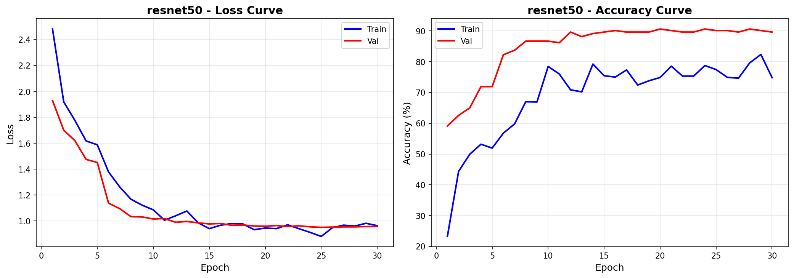
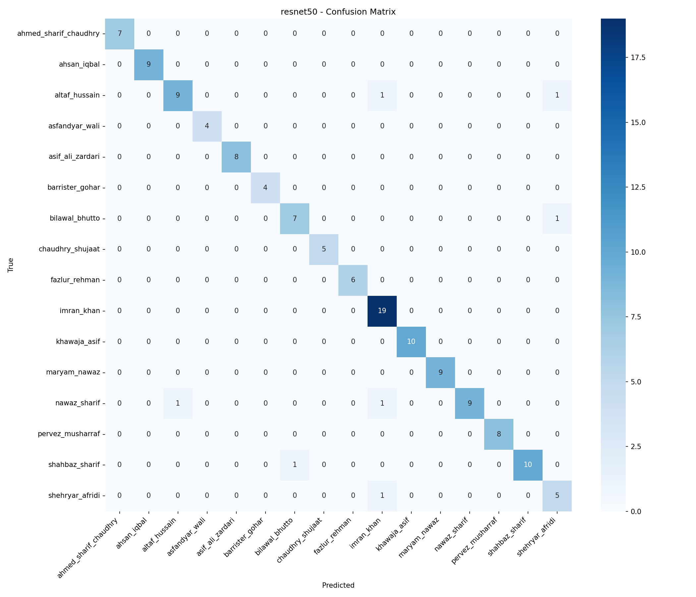
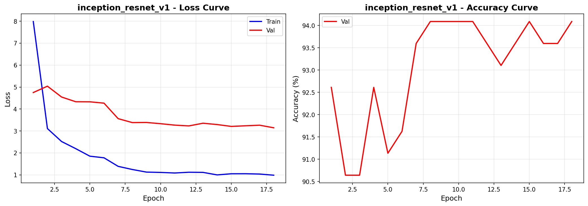
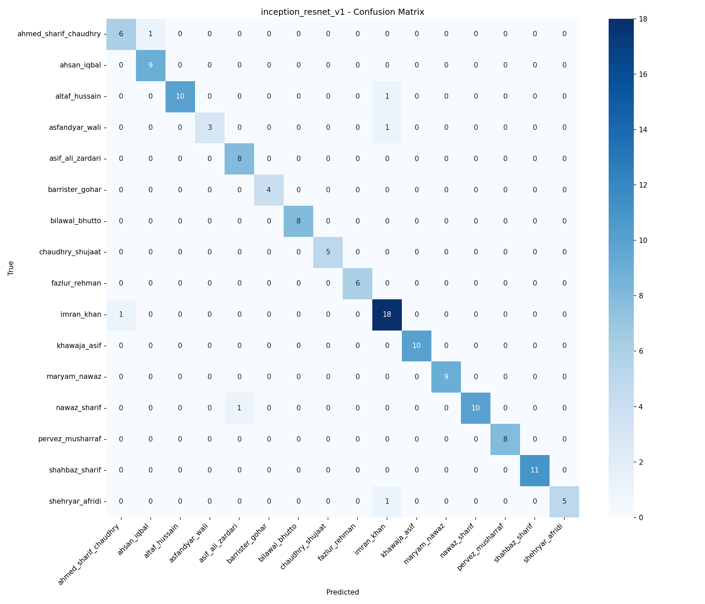
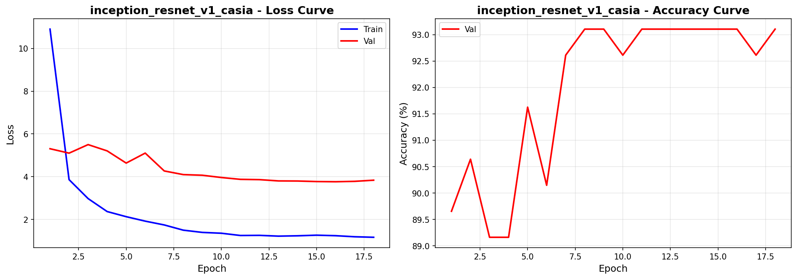
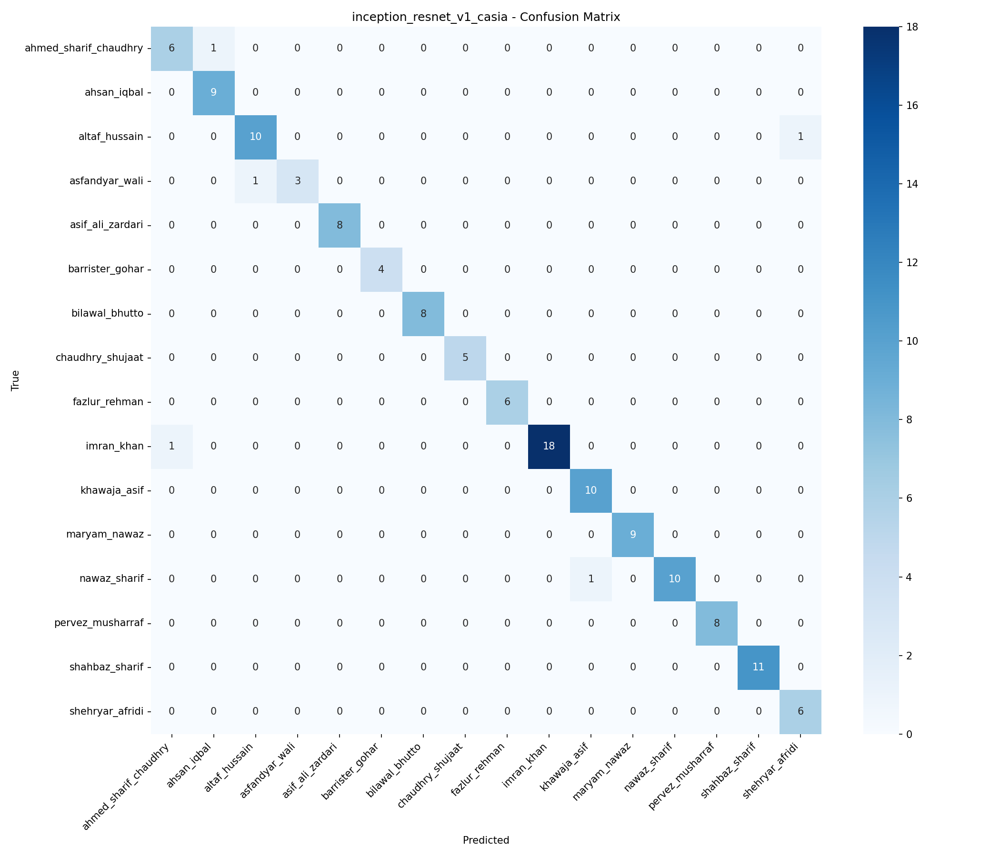

# Pakistani Politician Image Classifier

<div align="center">


**A multi-model facial recognition system for classifying 16 Pakistani politicians using deep learning, ArcFace metric learning, and a full MLOps pipeline.**

[Overview](#overview) · [Models & Results](#models--results) · [Training Plots](#training-plots) · [Installation](#installation) · [Usage](#usage) · [API](#api-documentation) · [MLOps](#mlops-pipeline) · [Deployment](#docker-deployment)

</div>

---

## Overview

This project classifies facial images of 16 prominent Pakistani politicians using three deep learning approaches:

- **InceptionResNetV1 + ArcFace** (VGGFace2 pretrained) — **83.64% validation accuracy**, **74.83% test accuracy**
- **InceptionResNetV1 + ArcFace** (CASIA-WebFace pretrained) — **81.78% validation accuracy**, **77.62% test accuracy**
- **ResNet50 Classifier** — **80.35% peak validation accuracy**, **76.03% test accuracy**

The system features MTCNN-based face detection with landmark alignment, a Flask REST API, a glassmorphism React frontend, and a complete MLOps stack (DVC, MLflow, Airflow, Docker).

---

## Classified Politicians (16 Classes)

| # | Name | # | Name |
|---|------|---|------|
| 1 | Ahmed Sharif Chaudhry | 9 | Fazlur Rehman |
| 2 | Ahsan Iqbal | 10 | Imran Khan |
| 3 | Altaf Hussain | 11 | Khawaja Asif |
| 4 | Asfandyar Wali | 12 | Maryam Nawaz |
| 5 | Asif Ali Zardari | 13 | Nawaz Sharif |
| 6 | Barrister Gohar | 14 | Pervez Musharraf |
| 7 | Bilawal Bhutto | 15 | Shahbaz Sharif |
| 8 | Chaudhry Shujaat | 16 | Shehryar Afridi |

---

## Models & Results

### Final Model Comparison

| Model | Best Val Accuracy | Test Accuracy | Macro Precision | Macro Recall | Macro F1 |
|-------|------------------|---------------|-----------------|--------------|----------|
| **InceptionResNetV1** (VGGFace2 + ArcFace) | **83.64%** | **74.83%** | 0.7750 | 0.7544 | 0.7593 |
| InceptionResNetV1 (CASIA-WebFace + ArcFace) | **81.78%** | **77.62%** | 0.7972 | 0.7820 | 0.7822 |
| ResNet50 (Transfer Learning) | 80.35% | 76.03% | 0.8010 | 0.7600 | 0.7630 |

> **Note on ResNet50:** Peak validation accuracy was **80.35%** at epoch 8. Test accuracy on the held-out set was **76.03%**, reflecting a generalisation gap caused by the small dataset size (see [Known Limitations](#known-limitations)).

### ArcFace Training Configuration

Both InceptionResNetV1 models used ArcFace metric learning with the following setup:

- `ArcMarginProduct`: in_features=512, out_features=16, s=64.0, m=0.3
- Validation logits computed **without** angular margin (cosine similarity only)
- Optimizer rebuilt at epoch 6 with ArcFace parameters retained across all groups
- Early stopping patience: 10 epochs

### ResNet50 Training Configuration

- Progressive unfreezing: backbone frozen for epochs 1–5, fully unfrozen from epoch 6
- Peak validation accuracy: **80.35%** at epoch 8
- Early stopping triggered at epoch 13
- Mixed precision training (AMP) enabled

---

## Training Plots

### ResNet50

**Training & Validation Curves**



> The sharp divergence between train (~98%) and validation (~80%) accuracy after epoch 6 (when the backbone was unfrozen) is a clear sign of overfitting — a direct consequence of the small dataset. Val loss plateaus around 0.9 while train loss approaches zero, confirming the model memorises training examples rather than generalising to unseen faces.

**Confusion Matrix**



---

### InceptionResNetV1 — VGGFace2 + ArcFace

**Training & Validation Curves**



> Train and val loss decrease and converge closely throughout training, demonstrating that ArcFace's angular margin regularisation significantly reduces overfitting compared to the ResNet50 approach. Val accuracy stabilises above 82% from epoch 3 onward, peaking at 83.64%.

**Confusion Matrix**



---

### InceptionResNetV1 — CASIA-WebFace + ArcFace

**Training & Validation Curves**



> The CASIA-pretrained model shows slightly more instability in early epochs (val accuracy dips around epoch 6) compared to the VGGFace2 variant. This is expected — VGGFace2 is a larger and more diverse face recognition dataset, providing a stronger pretrained initialisation. Despite this, the model plateaus near 81–82% validation accuracy by epoch 10 and maintains it through to early stopping at epoch 20.

**Confusion Matrix**



---

## Methodology

### ArcFace Models (InceptionResNetV1)

1. Detect faces via MTCNN with 5-point landmark detection
2. Align faces using landmark-based rotation and center crop with margin
3. Resize aligned faces to 336×336 and normalize
4. Extract 512-dimensional embeddings with InceptionResNetV1 backbone
5. Compute logits via ArcFace weight matrix with angular margin (s=64, m=0.3)
6. Return top-3 predictions with confidence scores

### ResNet50 Classifier

1. Resize image to 224×224 and normalize
2. Forward pass through fine-tuned ResNet50 (ImageNet pretrained)
3. Softmax over 16 class logits → return top-3 predictions

---

## Project Structure

```
pakistani-politician-classifier/
├── notebooks/
│   ├── COMPLETE_TRAINING_PIPELINE.ipynb  # Full training notebook
│   └── README.md
├── backend/                              # Flask inference API
├── frontend/                             # React glassmorphism web UI
├── src/                                  # Source code modules
│   ├── collect_data.py                  # Image crawling & filtering
│   ├── split_dataset.py                 # Train/val/test split
│   ├── augment.py                       # Data augmentation
│   ├── train.py                         # Training script
│   ├── evaluate.py                      # Evaluation & metrics
│   └── predict.py                       # Inference script
├── api/                                  # FastAPI REST API
├── docker/                              # Docker configuration
├── tests/                               # Unit tests
├── project_outputs/
│   ├── models/                          # Trained model checkpoints
│   └── results/                         # Evaluation reports & plots
├── dvc.yaml                             # DVC pipeline definition
├── params.yaml                          # Training hyperparameters
├── requirements.txt                     # Python dependencies
├── start.sh                             # Quick backend launcher
└── FINAL_IMPLEMENTATION_REPORT.md       # Detailed implementation report
```

---

## Installation

### Prerequisites

- Python 3.10+
- CUDA 11.7+ (optional, for GPU acceleration)
- Docker (optional, for containerised deployment)
- Git

### Local Setup

```bash
# Clone the repository
git clone https://github.com/Hanzala-12/pakistani-politician-classifier.git
cd pakistani-politician-classifier

# Create and activate a virtual environment
python -m venv venv
source venv/bin/activate        # Linux/macOS
# venv\Scripts\activate         # Windows

# Install dependencies
pip install -r requirements.txt

# (Optional) Initialize DVC for data versioning
dvc init
```

---

## Usage

### Data Pipeline

```bash
# Collect images via web crawler (Bing/Google)
python src/collect_data.py

# Split into train / val / test (75% / 15% / 10%)
python src/split_dataset.py

# Apply augmentation to the training set
python src/augment.py
```

### Training

```bash
python src/train.py
```

Key hyperparameters (`params.yaml`):

```yaml
training:
  batch_size: 32
  num_epochs: 20
  learning_rate: 0.0001
  weight_decay: 0.0001
  scheduler: cosine
  early_stopping_patience: 10
```

### Evaluation

```bash
python src/evaluate.py
```

Generates classification reports, confusion matrices, and a model comparison table saved to `project_outputs/results/`.

### Inference

```bash
python src/predict.py --image path/to/image.jpg --model inception_resnet_v1
```

### Quick Start

```bash
bash start.sh
```

---

## API Documentation

### Start the Server

```bash
# Development
uvicorn api.main:app --reload --port 8000

# Production
uvicorn api.main:app --host 0.0.0.0 --port 8000 --workers 4
```

### Endpoints

#### `GET /health`

```json
{
  "status": "ok",
  "models_loaded": ["inception_resnet_v1", "inception_resnet_v1_casia", "resnet50"],
  "device": "cuda"
}
```

#### `GET /classes`

```json
{
  "classes": ["ahmed_sharif_chaudhry", "ahsan_iqbal", "..."],
  "count": 16
}
```

#### `POST /predict`

```bash
curl -X POST "http://localhost:8000/predict" \
  -F "file=@politician.jpg" \
  -F "model_name=inception_resnet_v1"
```

```json
{
  "predicted_class": "imran_khan",
  "confidence": 0.94,
  "top3": [
    {"class": "imran_khan", "confidence": 0.94},
    {"class": "shahbaz_sharif", "confidence": 0.04},
    {"class": "nawaz_sharif", "confidence": 0.02}
  ],
  "model_used": "inception_resnet_v1",
  "inference_time_ms": 38.5
}
```

#### `POST /predict/batch`

```bash
curl -X POST "http://localhost:8000/predict/batch" \
  -F "files=@img1.jpg" \
  -F "files=@img2.jpg"
```

---

## Web Application

```bash
bash start.sh
# Frontend: http://localhost:5173
# API:      http://localhost:8000
```

**Features:** Drag-and-drop image upload · Model selection dropdown · Top-3 predictions with confidence bars · Real-time API health indicator · Glassmorphism UI with Framer Motion animations

**Tech Stack:** React 19 · TypeScript · Vite · Tailwind CSS 4 · Framer Motion · Lucide React

---

## MLOps Pipeline

### DVC — Data Versioning

```bash
dvc add data/raw dataset
dvc remote add -d myremote s3://your-bucket/politician-classifier
dvc push   # upload data
dvc pull   # restore on a new machine
```

### MLflow — Experiment Tracking

```bash
mlflow ui --port 5000
# View at http://localhost:5000
```

All training runs automatically log hyperparameters, per-epoch metrics, model artifacts, and evaluation plots.

### Airflow — Pipeline Orchestration

```bash
airflow standalone
airflow dags trigger politician_classifier_pipeline
```

DAG: `collect_data → split_dataset → augment → train → evaluate`

### CI/CD — GitHub Actions

Triggers on push to `main`/`develop` and on pull requests.

| Job | Description |
|-----|-------------|
| Test | Unit tests + linting |
| Build & Push | Docker image → Docker Hub |
| Deploy | SSH deploy to AWS EC2 |

**Required Secrets:** `DOCKER_USERNAME`, `DOCKER_PASSWORD`, `EC2_HOST`, `EC2_USER`, `EC2_PRIVATE_KEY`

---

## Docker Deployment

```bash
# Build the image
docker build -f docker/Dockerfile -t politician-classifier:latest .

# Run (model weights mounted as a volume — no rebuild needed on model updates)
docker run -d \
  --name politician-api \
  -p 8000:8000 \
  -v $(pwd)/project_outputs/models:/app/models \
  politician-classifier:latest

# Or with Docker Compose (API + MLflow)
docker-compose -f docker/docker-compose.yml up -d
```

---

## Testing

```bash
pytest tests/ -v
pytest tests/ --cov=src --cov-report=html
```

---

## Known Limitations

This project was built under real academic constraints. The following limitations are acknowledged honestly and transparently.

**Small Dataset**
Images were self-collected from public web sources (Bing/Google image search) with a target of ~80 images per class after face detection filtering. This is a very small dataset for a 16-class facial recognition task — production systems typically train on hundreds of thousands to millions of images per identity. Our dataset size is the single largest factor limiting accuracy and is the direct cause of the overfitting visible in ResNet50's training curves (train accuracy ~98% vs. val accuracy ~80%).

**Noisy, Imbalanced Web-Crawled Data**
Web-crawled images are inherently noisy: variable resolution, inconsistent lighting, mixed age ranges, and occasional mislabelled images. Some politicians have far more public imagery available than others, making truly balanced collection difficult. This introduces implicit bias in what each model learns per class.

**Small Test Set**
The held-out test set contains approximately 121 images across 16 classes (roughly 6–9 images per politician). Per-class statistics derived from such small samples carry high variance — a single misclassification can shift an individual class F1-score by over 10%. The reported numbers should be read as indicative, not as statistically stable benchmarks.

**Face Detection Dependency**
All three models require a detectable, reasonably frontal face. The ArcFace pipeline is additionally sensitive to face alignment quality from MTCNN's landmark detection. Heavily occluded faces, extreme head poses, very low-resolution images, or group photographs may cause detection failure or significantly degraded predictions.

**Multiprocessing Warnings During ResNet50 Training**
During ResNet50 training inside the Jupyter notebook, PyTorch's DataLoader produced `AssertionError: can only test a child process` warnings from multiprocessing worker cleanup at epoch boundaries. These are benign — they arise from how notebook kernels manage forked processes — and do not affect training correctness, convergence, or the saved model weights.

**No Real-Time or Video Inference**
The current system handles static images only. There is no streaming, webcam, or video frame inference pipeline.

---

## Future Work

- Expand the dataset with more diverse, verified images per class to reduce overfitting
- Ensemble inference combining all three models for higher robustness
- Test-time augmentation for more stable predictions on difficult inputs
- Model quantization for edge/mobile deployment
- Real-time video inference pipeline

---

## Contributing

1. Fork the repository
2. Create a feature branch: `git checkout -b feature/your-feature`
3. Commit: `git commit -m 'Add your feature'`
4. Push: `git push origin feature/your-feature`
5. Open a Pull Request

---

## License

MIT License — see [LICENSE](LICENSE) for details.

---

## Citation

```bibtex
@misc{pakistani_politician_classifier,
  title   = {Pakistani Politician Image Classifier},
  author  = {Hanzala},
  year    = {2026},
  url     = {https://github.com/Hanzala-12/pakistani-politician-classifier}
}
```

---

## Acknowledgements

- [facenet-pytorch](https://github.com/timesler/facenet-pytorch) — MTCNN face detection and InceptionResNetV1 implementation
- [PyTorch](https://pytorch.org/) and [torchvision](https://pytorch.org/vision/) — training infrastructure
- Image data collected from publicly available web sources

---

<div align="center">

**Made with ❤️ for Pakistan**

⭐ If you find this project useful, please give it a star!

</div>
